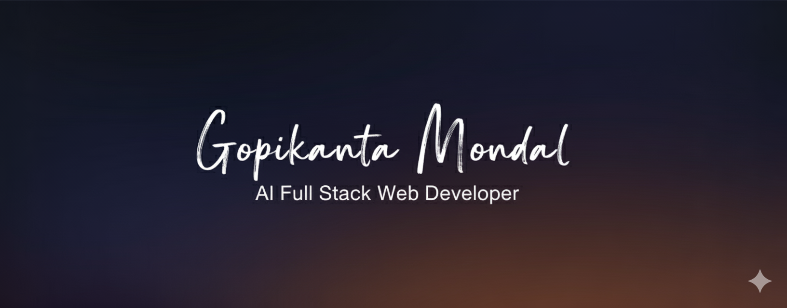
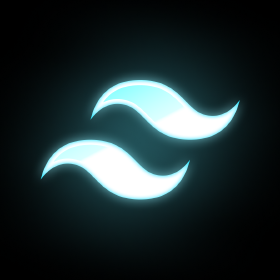
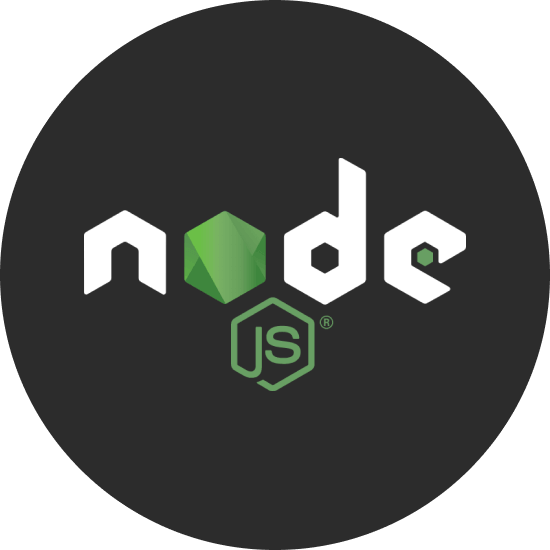
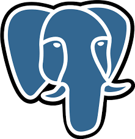

  

<h1 align="center">Hey, I'm Gopikanta Mondal ✨</h1>
<h3 align="center">AI Full Stack Developer | Open Source Enthusiast</h3>

## 🚀 About Me

> I'm a passionate Full Stack Developer from India, specializing in building scalable web applications and contributing to open source.

- Dream Project **CoderRoute**(https://coderroute.officialgopi.xyz)
- Learning **System Design**
- Ask me about **React, Node.js, Databases, System Designs**
- Reach me at [official.gopi@outlook.com](mailto:official.gopi@outlook.com)

<h1 align="left">🛠️ Technical Stack</h1>

  
  
  
  
  
  
  

  
  
  
  
  
  

  
  

## 📊 GitHub Stats

  
  

## 🔗 Connect With Me

  
  
  

  

---

  ⭐ If you like what I do, give my repositories a star!

